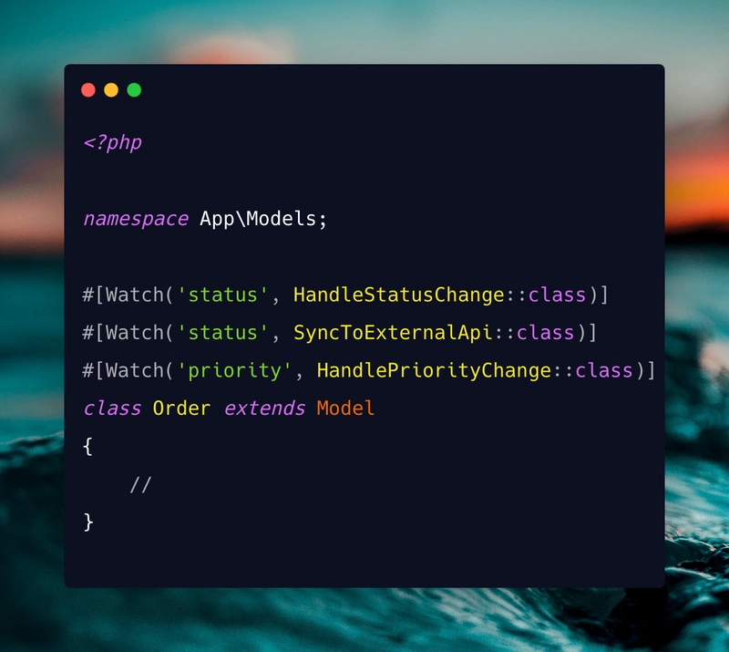

# Laravel Column Watcher

[](https://packagist.org/packages/ascend/laravel-column-watcher)
[](tests)
[](composer.json)
[](composer.json)
[](LICENSE)

A Laravel package that provides attribute-based column watching for Eloquent models. React to specific column changes without the boilerplate of full model observers.





## Table of Contents

- [The Problem](#the-problem)
- [The Solution](#the-solution)
- [Installation](#installation)
- [Usage](#usage)
  - [Create a Handler](#1-create-a-handler)
  - [Register the Watcher](#2-register-the-watcher)
  - [Watch Multiple Columns](#3-watch-multiple-columns)
  - [Multiple Watchers](#4-multiple-watchers)
  - [Timing: Before vs After Save](#5-timing-before-vs-after-save)
  - [Queueable Handlers](#6-queueable-handlers)
- [The ColumnChange Object](#the-columnchange-object)
- [Real-World Examples](#real-world-examples)
- [Comparison with Observers](#comparison-with-observers)
- [Disabling Watchers](#disabling-watchers)
- [Events](#events)
- [Laravel Octane Compatibility](#laravel-octane-compatibility)
- [Configuration](#configuration)
- [Artisan Commands](#artisan-commands)
- [Testing](#testing)
  - [Cleaning Up Fake State](#cleaning-up-fake-state)
  - [Testing Queued Handlers with DatabaseTransactions](#testing-queued-handlers-with-databasetransactions)
- [Edge Cases & Limitations](#edge-cases--limitations)
- [Requirements](#requirements)

## The Problem

Laravel's observer pattern is powerful but fundamentally flawed for column-level reactions. What starts as a simple "notify when status changes" requirement quickly becomes a maintenance burden.

### The "God Observer" Anti-Pattern

Observers tend to grow into monolithic classes that handle everything:

```php
class RequestObserver
{
    public function saved(Request $request): void
    {
        if ($request->wasChanged('status')) {
            HandleStatusChange::dispatch($request);
            NotifyAdmins::dispatch($request);
            SyncToExternalApi::dispatch($request);
        }

        if ($request->wasChanged('priority')) {
            HandlePriorityChange::dispatch($request);
        }

        if ($request->wasChanged('assigned_to')) {
            NotifyAssignee::dispatch($request);
            AuditAssignmentChange::dispatch($request);
        }

        if ($request->wasChanged(['name', 'description'])) {
            IndexForSearch::dispatch($request);
        }

        // ... and it keeps growing
    }
}
```

This violates the Single Responsibility Principle. Your observer becomes a dumping ground for unrelated concerns, making it difficult to understand, maintain, and test.

### Observers Can't Be Mocked

Testing observer behaviour is notoriously difficult:

```php
// You can't do this:
RequestObserver::fake();

// You're forced to either:
// 1. Test side-effects directly (fragile, slow)
// 2. Disable observers entirely (loses coverage)
// 3. Create elaborate test doubles (complex, brittle)
```

There's no clean way to verify that your observer logic was triggered without testing the downstream effects. This leads to either undertested code or slow, integration-heavy test suites.

### Observers Can't Be Queued

When your observer needs to call a slow external API, you're stuck dispatching a job from within the observer:

```php
class RequestObserver
{
    public function saved(Request $request): void
    {
        if ($request->wasChanged('status')) {
            // You can't queue the observer itself
            // You must create and dispatch a separate job
            SyncStatusToExternalApi::dispatch($request);
        }
    }
}
```

This means creating two classes for every async operation: the observer to detect the change, and the job to handle it. The observer becomes nothing more than a dispatcher.

### The Hidden Coupling Problem

Observers create invisible dependencies:

```php
// Looking at this model, you have no idea what happens when you save it
class Request extends Model
{
    protected $fillable = ['status', 'priority', 'name'];
}

// The observer is registered in a service provider far, far away
// Surprise side-effects await anyone who modifies this model
```

New developers (and future you) must hunt through service providers and observer classes to understand what happens when a model changes.

### Summary of Observer Pain Points

- **Untestable**: No mocking, no faking, no assertions
- **Not queueable**: Must dispatch separate jobs for async work
- **God class tendency**: All column logic piles into one file
- **Hidden behaviour**: Registration buried in service providers
- **Boilerplate heavy**: Separate class + registration for simple reactions
- **All-or-nothing**: Fires on every save, requires manual change detection

## The Solution

Column Watcher represents a paradigm shift in how you react to model changes. Instead of centralised observers, you get:

- **Fakeble handlers** with built-in test assertions
- **Queueable handlers** that run in the background
- **Single-purpose handlers** that do one thing well
- **Visible declarations** right on your model

```php
use Ascend\LaravelColumnWatcher\Attributes\Watch;

#[Watch('status', HandleStatusChange::class)]
#[Watch('status', SyncToExternalApi::class)]
#[Watch('priority', HandlePriorityChange::class)]
class Request extends Model
{
    // Anyone reading this model immediately knows what happens on change
    // Separate concern, separate handler
}
```

Each handler is a focused, testable, optionally-queueable class.

**Fully mockable and fakeable:**

```php
HandleStatusChange::fake();

$request->update(['status' => 'approved']);

HandleStatusChange::assertTriggered();
```

**Queueable with a single interface:**

```php
class SyncToExternalApi extends ColumnWatcher implements ShouldQueue
{
    protected function execute(ColumnChange $change): void
    {
        // Runs in the background automatically
    }
}
```

No observer class. No service provider registration. No manual change detection. The handler only runs when `status` actually changes.

## Installation

```bash
composer require ascend/laravel-column-watcher
```

The package auto-discovers its service provider. No manual registration needed.

## Usage

### 1. Create a Handler

Generate a handler using the artisan command:

```bash
php artisan make:watcher HandleStatusChange

# For queueable handlers (runs in background):
php artisan make:watcher SyncToExternalService --queued
```

This creates `app/Watchers/HandleStatusChange.php`:

```php
<?php

namespace App\Watchers;

use Ascend\LaravelColumnWatcher\ColumnWatcher;
use Ascend\LaravelColumnWatcher\Data\ColumnChange;

class HandleStatusChange extends ColumnWatcher
{
    protected function execute(ColumnChange $change): void
    {
        // $change->model    - The model instance
        // $change->column   - The column that changed ('status')
        // $change->oldValue - The previous value
        // $change->newValue - The new value
    }
}
```

All handlers extend `ColumnWatcher`, which includes built-in testing utilities like `HandleStatusChange::fake()` and `HandleStatusChange::assertTriggered()`. See [Testing](#testing) for details.

### 2. Register the Watcher

#### Option A: Using Attributes (Recommended)

Add the `#[Watch]` attribute to your model class:

```php
<?php

namespace App\Models;

use Ascend\LaravelColumnWatcher\Attributes\Watch;
use App\Watchers\HandleStatusChange;
use Illuminate\Database\Eloquent\Model;

#[Watch('status', HandleStatusChange::class)]
class Request extends Model
{
    // ...
}
```

#### Option B: Programmatic Registration

Register watchers in a service provider:

```php
use Ascend\LaravelColumnWatcher\ColumnWatcher;
use App\Models\Request;
use App\Watchers\HandleStatusChange;

class AppServiceProvider extends ServiceProvider
{
    public function boot(): void
    {
        ColumnWatcher::register(Request::class, 'status', HandleStatusChange::class);
    }
}
```

### 3. Watch Multiple Columns

A single handler can watch multiple columns:

```php
#[Watch(['name', 'email', 'phone'], HandleContactInfoChange::class)]
class User extends Model {}
```

When any of these columns change, the handler receives a `ColumnChange` object that tells you which specific column triggered it:

```php
class HandleContactInfoChange extends ColumnWatcher
{
    protected function execute(ColumnChange $change): void
    {
        Log::info("User {$change->column} changed", [
            'from' => $change->oldValue,
            'to' => $change->newValue,
        ]);
    }
}
```

### 4. Multiple Watchers

You can attach multiple watchers to the same model:

```php
#[Watch('status', HandleStatusChange::class)]
#[Watch('status', NotifyAdmins::class)]
#[Watch('priority', HandlePriorityChange::class)]
class Request extends Model {}
```

### 5. Timing: Before vs After Save

By default, handlers run **after** the model is saved (`Timing::SAVED`). You can run them **before** save using the `timing` parameter:

```php
use Ascend\LaravelColumnWatcher\Enums\Timing;

// Runs AFTER save (default) - use for notifications, logging, side effects
#[Watch('status', SendNotification::class)]

// Runs BEFORE save - use for validation, transformation, blocking saves
#[Watch('status', ValidateStatusTransition::class, Timing::SAVING)]
```

**When to use each:**

| Timing | Event | Use Case |
|--------|-------|----------|
| `Timing::SAVED` (default) | After database write | Notifications, logging, external API calls |
| `Timing::SAVING` | Before database write | Validation, data transformation, blocking invalid changes |

### 6. Queueable Handlers

For handlers that perform slow operations (sending emails, calling APIs), add `implements ShouldQueue` to run them in the background:

```bash
php artisan make:watcher SyncToExternalService --queued
```

```php
use Ascend\LaravelColumnWatcher\ColumnWatcher;
use Ascend\LaravelColumnWatcher\Data\ColumnChange;
use Illuminate\Contracts\Queue\ShouldQueue;

class SyncToExternalService extends ColumnWatcher implements ShouldQueue
{
    protected function execute(ColumnChange $change): void
    {
        // This runs in the background via queue worker
        ExternalApi::sync($change->model);
    }
}
```

You can optionally configure queue behaviour using standard Laravel properties:

```php
class SyncToExternalService extends ColumnWatcher implements ShouldQueue
{
    public $connection = 'redis';
    public $queue = 'external-sync';
    public $tries = 3;
    public $timeout = 30;

    protected function execute(ColumnChange $change): void
    {
        // ...
    }
}
```

**Note:** Queueable handlers only work with `timing: Timing::SAVED` (the default). Using `timing: Timing::SAVING` with a queueable handler would defeat the purpose since the save hasn't happened yet.

## The ColumnChange Object

Handlers receive a `ColumnChange` object with these properties and methods:

```php
class HandleStatusChange extends ColumnWatcher
{
    protected function execute(ColumnChange $change): void
    {
        // Properties
        $change->model;     // The Eloquent model instance
        $change->column;    // The column name that changed (string)
        $change->oldValue;  // The previous value (mixed)
        $change->newValue;  // The new value (mixed)

        // Helper methods
        $change->hasChanged();  // true if oldValue !== newValue
        $change->wasNull();     // true if oldValue was null
        $change->isNull();      // true if newValue is null
        $change->wasEmpty();    // true if oldValue was empty
        $change->isEmpty();     // true if newValue is empty
    }
}
```

## Real-World Examples

### Send Notification on Status Change

```php
#[Watch('status', HandleRequestStatusChange::class)]
class Request extends Model {}
```

```php
class HandleRequestStatusChange extends ColumnWatcher
{
    protected function execute(ColumnChange $change): void
    {
        $request = $change->model;

        match ($change->newValue) {
            'approved' => $request->submitter->notify(new RequestApproved($request)),
            'rejected' => $request->submitter->notify(new RequestRejected($request)),
            default => null,
        };
    }
}
```

### Audit Trail for Sensitive Fields

```php
#[Watch(['email', 'password', 'role'], AuditSensitiveChange::class)]
class User extends Model {}
```

```php
class AuditSensitiveChange extends ColumnWatcher
{
    protected function execute(ColumnChange $change): void
    {
        AuditLog::create([
            'user_id' => $change->model->id,
            'field' => $change->column,
            'old_value' => $change->column === 'password' ? '[redacted]' : $change->oldValue,
            'new_value' => $change->column === 'password' ? '[redacted]' : $change->newValue,
            'changed_by' => auth()->id(),
        ]);
    }
}
```

### Validate State Transitions

```php
#[Watch('status', ValidateStatusTransition::class, Timing::SAVING)]
class Order extends Model {}
```

```php
class ValidateStatusTransition extends ColumnWatcher
{
    private array $allowedTransitions = [
        'pending' => ['processing', 'cancelled'],
        'processing' => ['shipped', 'cancelled'],
        'shipped' => ['delivered'],
    ];

    protected function execute(ColumnChange $change): void
    {
        $allowed = $this->allowedTransitions[$change->oldValue] ?? [];

        if (!in_array($change->newValue, $allowed)) {
            throw new InvalidStatusTransition(
                "Cannot transition from {$change->oldValue} to {$change->newValue}"
            );
        }
    }
}
```

### Sync to External Service (Queued)

```php
#[Watch(['name', 'email', 'plan'], SyncToStripe::class)]
class Customer extends Model {}
```

```php
class SyncToStripe extends ColumnWatcher implements ShouldQueue
{
    public $queue = 'integrations';

    protected function execute(ColumnChange $change): void
    {
        $customer = $change->model;

        // Resolve dependencies in execute(), not the constructor
        // Constructor injection doesn't work with queued jobs
        $stripe = app(StripeClient::class);

        $stripe->customers->update($customer->stripe_id, [
            'name' => $customer->name,
            'email' => $customer->email,
            'metadata' => ['plan' => $customer->plan],
        ]);
    }
}
```

**Important:** Don't use constructor dependency injection in queueable handlers. Laravel serializes the job for the queue and cannot restore injected dependencies. Use `app()` or `resolve()` inside the `execute()` method instead.

## Comparison with Observers

| Feature | Observers | Column Watcher |
|---------|-----------|----------------|
| **Testing** | Cannot be mocked or faked | Built-in `fake()`, `assertTriggered()` |
| **Queueing** | Must dispatch separate jobs | `implements ShouldQueue` on handler |
| **Code organisation** | Tends toward "God observer" | One handler per concern |
| **Declaration** | Separate class + service provider | Attribute on model |
| **Visibility** | Hidden in observer class | Visible on model |
| **Granularity** | All model events | Specific columns only |
| **Change detection** | Manual (`wasChanged()`) | Automatic |
| **Multiple handlers** | One observer per model | Multiple `#[Watch]` attributes |
| **Timing control** | Different methods | Single `timing` parameter |

### Before: Observer Approach

```php
// app/Observers/RequestObserver.php
class RequestObserver
{
    public function saved(Request $request): void
    {
        if ($request->wasChanged('status')) {
            HandleStatusChange::dispatch($request);
        }

        if ($request->wasChanged('priority')) {
            HandlePriorityChange::dispatch($request);
        }

        if ($request->wasChanged(['name', 'description'])) {
            HandleMetadataChange::dispatch($request);
        }
    }
}

// app/Providers/AppServiceProvider.php
public function boot(): void
{
    Request::observe(RequestObserver::class);
}
```

### After: Column Watcher Approach

```php
// app/Models/Request.php
#[Watch('status', HandleStatusChange::class)]
#[Watch('priority', HandlePriorityChange::class)]
#[Watch(['name', 'description'], HandleMetadataChange::class)]
class Request extends Model {}
```

## Disabling Watchers

You can temporarily disable watchers globally (useful for migrations, seeding, or testing):

```php
use Ascend\LaravelColumnWatcher\ColumnWatcher;

// Disable all watchers
ColumnWatcher::disable();

// Run operations without triggering watchers
$request->update(['status' => 'archived']);

// Re-enable watchers
ColumnWatcher::enable();

// Check if enabled
if (ColumnWatcher::isEnabled()) {
    // ...
}
```

Or use the config:

```php
// config/column-watcher.php
return [
    'enabled' => env('COLUMN_WATCHER_ENABLED', true),
];
```

## Events

The package dispatches events during watcher execution, allowing you to hook into the lifecycle for logging, metrics, or error tracking.

### Available Events

| Event | Dispatched When |
|-------|-----------------|
| `WatcherStarted` | Before the watcher's `execute()` method runs |
| `WatcherSucceeded` | After `execute()` completes successfully |
| `WatcherFailed` | When `execute()` throws an exception |

All events contain a reference to the watcher instance, giving you access to the model, column, and values:

```php
use Ascend\LaravelColumnWatcher\Events\WatcherStarted;
use Ascend\LaravelColumnWatcher\Events\WatcherSucceeded;
use Ascend\LaravelColumnWatcher\Events\WatcherFailed;

// In a service provider or listener
Event::listen(WatcherStarted::class, function (WatcherStarted $event) {
    Log::debug('Watcher starting', [
        'watcher' => get_class($event->watcher),
        'model' => get_class($event->watcher->model),
        'model_id' => $event->watcher->model->getKey(),
        'column' => $event->watcher->column,
        'old_value' => $event->watcher->oldValue,
        'new_value' => $event->watcher->newValue,
    ]);
});

Event::listen(WatcherSucceeded::class, function (WatcherSucceeded $event) {
    Metrics::increment('watcher.success', [
        'watcher' => get_class($event->watcher),
    ]);
});

Event::listen(WatcherFailed::class, function (WatcherFailed $event) {
    Log::error('Watcher failed', [
        'watcher' => get_class($event->watcher),
        'exception' => $event->exception->getMessage(),
    ]);

    // Report to error tracking service
    report($event->exception);
});
```

### Events Fire for Both Sync and Queued Handlers

Events are dispatched inside the watcher's `handle()` method, which means they fire:

- **Synchronous handlers**: Events fire immediately during the model save
- **Queued handlers**: Events fire when the queue worker processes the job

This gives you consistent behaviour regardless of how the watcher is executed.

## Laravel Octane Compatibility

This package is fully compatible with Laravel Octane. Internal state is stored using Laravel's scoped container bindings, which are automatically reset between requests.

You don't need to do anything special - it just works. The package avoids static properties that could cause state to bleed between requests in Octane's long-running worker processes.

## Configuration

Publish the config file:

```bash
php artisan vendor:publish --tag=column-watcher-config
```

```php
// config/column-watcher.php
return [
    // Globally enable/disable column watching
    'enabled' => env('COLUMN_WATCHER_ENABLED', true),

    // Default namespace for generated watchers
    'namespace' => 'App\\Watchers',

    // Directories to scan for models (used by watcher:list)
    'model_paths' => ['app/Models'],
];
```

## Artisan Commands

### `watcher:list`

List all registered column watchers in your application:

```bash
php artisan watcher:list
```

Output (styled similar to Laravel's `event:list`):

```
  App\Models\Request.status (SAVED) ........................................
  ⇂ App\Watchers\HandleStatusChange
  ⇂ App\Watchers\NotifyAdmins [queued]

  App\Models\Request.status (SAVING) .......................................
  ⇂ App\Watchers\ValidateStatusTransition

  App\Models\Request.priority (SAVED) ......................................
  ⇂ App\Watchers\HandlePriorityChange

  App\Models\User.email (SAVED) ............................................
  ⇂ App\Watchers\SendEmailVerification [queued]
```

The command scans model directories configured in `model_paths` and includes programmatically registered watchers. Queueable handlers are marked with `[queued]`.

### `make:watcher`

Generate a new watcher handler class:

```bash
# Create a basic watcher
php artisan make:watcher HandleStatusChange

# Create a queueable watcher (runs in background)
php artisan make:watcher SyncToExternalService --queued
```

This creates a file in `app/Watchers/` (configurable via `namespace` in config):

```php
<?php

namespace App\Watchers;

use Ascend\LaravelColumnWatcher\ColumnWatcher;
use Ascend\LaravelColumnWatcher\Data\ColumnChange;

class HandleStatusChange extends ColumnWatcher
{
    protected function execute(ColumnChange $change): void
    {
        //
    }
}
```

With `--queued`, the class also implements `ShouldQueue`:

```php
use Illuminate\Contracts\Queue\ShouldQueue;

class SyncToExternalService extends ColumnWatcher implements ShouldQueue
{
    protected function execute(ColumnChange $change): void
    {
        //
    }
}
```

## Testing

### Faking Handlers

All handlers that extend `ColumnWatcher` can be faked for testing, similar to Laravel's notification and event faking:

```php
use App\Watchers\HandleStatusChange;

public function test_status_change_triggers_handler(): void
{
    HandleStatusChange::fake();

    $request = Request::factory()->create(['status' => 'draft']);
    $request->update(['status' => 'submitted']);

    // Assert the handler was triggered
    HandleStatusChange::assertTriggered();

    // Assert with specific conditions
    HandleStatusChange::assertTriggered(
        fn ($change) => $change->newValue === 'submitted'
    );

    // Assert specific values
    HandleStatusChange::assertTriggeredWithValues('draft', 'submitted');

    // Assert for a specific column
    HandleStatusChange::assertTriggeredForColumn('status');

    // Assert triggered exactly N times
    HandleStatusChange::assertTriggeredTimes(1);
}

public function test_handler_not_triggered_when_column_unchanged(): void
{
    HandleStatusChange::fake();

    $request = Request::factory()->create(['status' => 'draft']);
    $request->update(['name' => 'New Name']); // status not changed

    HandleStatusChange::assertNotTriggered();
}
```

### Available Assertions

| Method | Description |
|--------|-------------|
| `Handler::fake()` | Start faking the handler |
| `Handler::stopFaking()` | Stop faking and clear recorded changes |
| `Handler::assertTriggered()` | Assert handler was triggered at least once |
| `Handler::assertTriggered($callback)` | Assert with custom condition |
| `Handler::assertNotTriggered()` | Assert handler was never triggered |
| `Handler::assertTriggeredTimes($n)` | Assert handler was triggered exactly N times |
| `Handler::assertTriggeredForColumn($col)` | Assert handler was triggered for specific column |
| `Handler::assertTriggeredWithValues($old, $new)` | Assert handler was triggered with specific values |
| `Handler::recorded()` | Get all recorded ColumnChange objects |

### Accessing Recorded Changes

When faking, you can access all recorded changes:

```php
HandleStatusChange::fake();

$request->update(['status' => 'submitted']);
$request->update(['status' => 'approved']);

$changes = HandleStatusChange::recorded();

// $changes is an array of ColumnChange objects
$this->assertCount(2, $changes);
$this->assertEquals('submitted', $changes[0]->newValue);
$this->assertEquals('approved', $changes[1]->newValue);
```

### Disabling All Watchers

To disable all watchers globally (useful for migrations, seeding, or bulk operations):

```php
use Ascend\LaravelColumnWatcher\ColumnWatcher;

ColumnWatcher::disable();

// Watchers won't fire for any operations
$request->update(['status' => 'archived']);

ColumnWatcher::enable();
```

### Testing Without Faking

You can also test handler side-effects directly:

```php
public function test_status_change_sends_notification(): void
{
    Notification::fake();

    $request = Request::factory()->create(['status' => 'draft']);
    $request->update(['status' => 'submitted']);

    Notification::assertSentTo($request->submitter, RequestSubmitted::class);
}
```

### Cleaning Up Fake State

When mixing tests that use `fake()` with tests that need watchers to actually execute, call `stopFaking()` in your `tearDown()` to prevent state pollution between tests:

```php
protected function tearDown(): void
{
    HandleStatusChange::stopFaking();
    parent::tearDown();
}
```

Without this, a test that calls `fake()` will leave the watcher in fake mode, causing subsequent tests that expect the watcher to run to fail silently.

### Testing Queued Handlers with DatabaseTransactions

When using Laravel's `DatabaseTransactions` trait, queued handlers won't execute because they wait for `DB::afterCommit()`, which never fires (transactions are rolled back, not committed).

Call `withoutAfterCommit()` in your `setUp()` to bypass this:

```php
use Ascend\LaravelColumnWatcher\ColumnWatcher;

protected function setUp(): void
{
    parent::setUp();
    ColumnWatcher::withoutAfterCommit();
}

public function test_status_change_sends_notification(): void
{
    Notification::fake();

    $request = Request::factory()->create(['status' => 'draft']);
    $request->update(['status' => 'submitted']);

    // This now works with DatabaseTransactions
    Notification::assertSentTo($request->submitter, RequestSubmitted::class);
}
```

**Note:** `withoutAfterCommit()` is safe to call unconditionally - it only affects behaviour when there's an active transaction.

## Edge Cases & Limitations

### Model Creation

Watchers fire on both `create()` and `update()` operations. When a model is created, the "old value" will be `null` for all columns:

```php
$user = User::create(['status' => 'active']);
// Watcher fires with: oldValue = null, newValue = 'active'
```

### Infinite Loop Protection

The package automatically prevents infinite loops when a watcher saves the same model:

```php
class StatusWatcher extends ColumnWatcher
{
    protected function execute(ColumnChange $change): void
    {
        // This save won't trigger StatusWatcher again for the same column
        $change->model->updated_at = now();
        $change->model->save();
    }
}
```

However, be careful with watchers that modify different columns watched by other handlers.

### Transaction Safety

Queued handlers are dispatched after the database transaction commits. If a transaction rolls back, the queued job will not be dispatched:

```php
DB::transaction(function () {
    $order->status = 'approved';
    $order->save(); // Handler queued but not dispatched yet

    throw new Exception('Oops!'); // Transaction rolls back
});
// Queue job is never dispatched - correct behavior!
```

### Deleted Models and Queued Handlers

If a model is deleted before a queued handler processes, Laravel will throw a `ModelNotFoundException`. Handle this in your handler if needed:

```php
class SyncToExternal extends ColumnWatcher implements ShouldQueue
{
    protected function execute(ColumnChange $change): void
    {
        // Model is guaranteed to exist here because SerializesModels
        // throws ModelNotFoundException before execute() is called
        // if the model was deleted
    }

    public function failed(\Throwable $exception): void
    {
        if ($exception instanceof \Illuminate\Database\Eloquent\ModelNotFoundException) {
            // Model was deleted, handle gracefully
            return;
        }

        throw $exception;
    }
}
```

### Queueable Handlers Must Use `Timing::SAVED`

You cannot use queueable handlers with `Timing::SAVING`. This is enforced at registration time:

```php
use Ascend\LaravelColumnWatcher\Enums\Timing;

// This will throw InvalidTimingException
#[Watch('status', QueueableHandler::class, Timing::SAVING)]
class Order extends Model {}
```

## Requirements

- PHP 8.2+
- Laravel 11 or 12

## License

MIT
